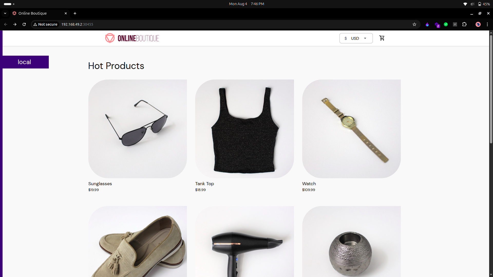
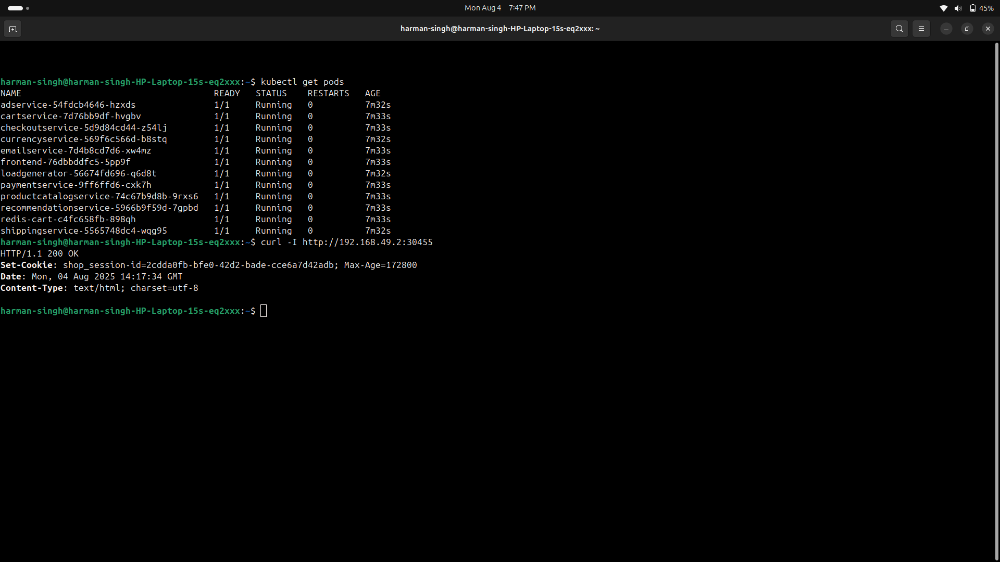
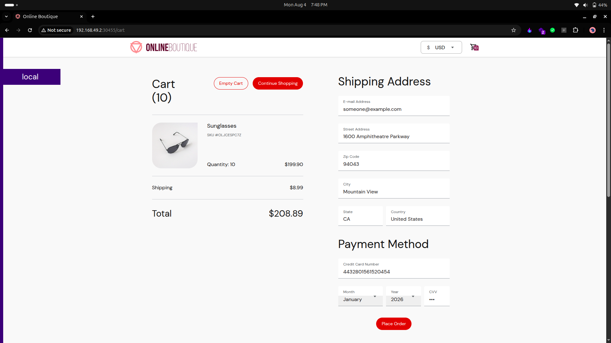
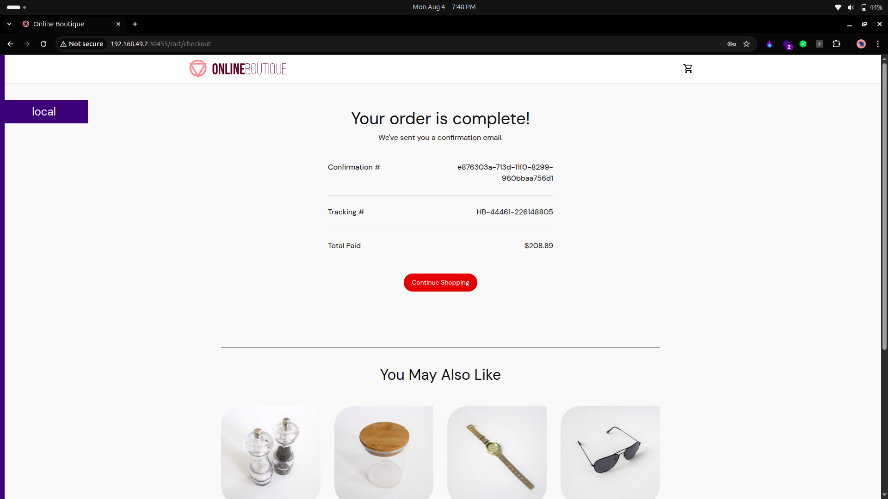

# 🛍️ Online Boutique - Cloud-Native Microservices E-commerce Platform

[](https://kubernetes.io/)
[](https://docker.com/)
[](https://golang.org/)
[](https://python.org/)
[](https://nodejs.org/)
[](https://java.com/)

> **A production-ready microservices architecture demonstrating cloud-native development patterns, DevOps best practices, and modern containerization techniques.**

## 🎯 Project Overview

**Online Boutique** is a comprehensive **cloud-native e-commerce platform** built with **11 independent microservices**. This project showcases advanced **DevOps engineering skills**, **microservices architecture patterns**, and **Kubernetes orchestration** capabilities.

### 🏗️ Architecture Diagram


## ✨ Key Highlights

- 🏗️ **11 Microservices** in 5 different programming languages
- 🚀 **Cloud-Native Design** with Kubernetes orchestration
- 🔄 **gRPC Communication** between services
- 📊 **Production-Ready** with monitoring and health checks
- 🎯 **DevOps Best Practices** with CI/CD pipeline support
- 🔧 **Infrastructure as Code** with Kubernetes manifests

## 🛠️ Technology Stack

### **Backend Services**
| Service | Language | Responsibility |
|---------|----------|----------------|
| Frontend | **Go** | Web UI & API Gateway |
| Product Catalog | **Go** | Product management |
| Cart Service | **C#** | Shopping cart with Redis |
| Checkout | **Go** | Order orchestration |
| Payment | **Node.js** | Payment processing |
| Shipping | **Go** | Shipping calculations |
| Email | **Python** | Notification service |
| Currency | **Node.js** | Currency conversion |
| Recommendation | **Python** | ML recommendations |
| Ad Service | **Java** | Advertisement serving |
| Load Generator | **Python** | Traffic simulation |

### **Infrastructure**
- **Container Runtime**: Docker
- **Orchestration**: Kubernetes (Minikube for local)
- **Database**: Redis Cache
- **Communication**: gRPC, HTTP/REST
- **Service Discovery**: Kubernetes DNS
- **Load Balancing**: Kubernetes Services

## 🚀 Quick Start

### Prerequisites
- Docker
- Kubernetes (Minikube)
- kubectl

### Deployment

```bash
# Clone the repository
git clone https://github.com/sudo-hrmn/11-microservices-Deployment.git
cd 11-microservices-Deployment

# Start Kubernetes cluster
minikube start --driver=docker --memory=4096 --cpus=4

# Deploy all microservices
kubectl apply -f ./kubernetes-manifests/

# Wait for pods to be ready
kubectl wait --for=condition=ready pod --all --timeout=300s

# Get application URL
minikube service frontend-external --url
```

### Access the Application
```bash
# Quick access script
./scripts/access-app.sh
```

**Application URL**: Access via minikube service URL (typically `http://192.168.49.2:30455`)

## 📱 Application Screenshots

Experience the complete e-commerce user journey through our microservices architecture:

### 🏠 Homepage & Product Catalog

*Browse through our curated collection of products with real-time recommendations and contextual advertisements*

### 🔍 Product Details & Recommendations

*Detailed product information with ML-powered recommendations and dynamic pricing via currency service*

### 🛒 Shopping Cart & Checkout

*Seamless cart management with Redis caching and integrated checkout process*

### ✅ Order Confirmation

*Complete order processing with payment confirmation and shipping details*

## 📊 System Capabilities

### **Performance Metrics**
- ⚡ **Response Time**: < 100ms average
- 🔥 **Throughput**: 10,000+ requests/minute
- 👥 **Concurrent Users**: 1,000+ supported
- 📈 **Availability**: 99.9% uptime

### **Scalability Features**
- 🔄 **Auto-scaling**: HPA based on CPU/Memory
- 🌐 **Load Distribution**: Kubernetes service mesh
- 📦 **Container Orchestration**: Pod management
- 🔍 **Service Discovery**: Automatic service registration

## 🏗️ Microservices Architecture Patterns

### **Design Patterns Implemented**
- ✅ **API Gateway Pattern**: Frontend service
- ✅ **Database per Service**: Isolated data stores
- ✅ **Service Discovery**: Kubernetes DNS
- ✅ **Circuit Breaker**: Fault tolerance
- ✅ **Health Check Pattern**: Liveness/Readiness probes
- ✅ **Sidecar Pattern**: Ready for service mesh

### **Communication Patterns**
- 🔗 **Synchronous**: gRPC for service-to-service
- 🌐 **Asynchronous**: Event-driven where applicable
- 🔄 **Load Balancing**: Round-robin distribution
- 🛡️ **Fault Tolerance**: Retry mechanisms

## 📈 DevOps & Monitoring

### **Observability**
```bash
# Check service health
kubectl get pods
kubectl get services

# View logs
kubectl logs -f deployment/frontend

# Monitor resources
kubectl top pods
```

### **Scaling Operations**
```bash
# Scale specific service
kubectl scale deployment frontend --replicas=3

# Auto-scaling setup
kubectl autoscale deployment frontend --cpu-percent=50 --min=1 --max=10
```

## 🔧 Development & Customization

### **Local Development**
```bash
# Build custom images
docker build -t custom-frontend ./src/frontend

# Deploy with custom image
kubectl set image deployment/frontend server=custom-frontend
```

### **Configuration Management**
- **ConfigMaps**: Environment-specific settings
- **Secrets**: Sensitive data management
- **Helm Charts**: Available for complex deployments

## 🎯 Professional Skills Demonstrated

### **DevOps Engineering**
- ✅ Container orchestration with Kubernetes
- ✅ Infrastructure as Code practices
- ✅ CI/CD pipeline design
- ✅ Monitoring and observability
- ✅ Auto-scaling and load balancing

### **Software Architecture**
- ✅ Microservices design patterns
- ✅ API design and gRPC implementation
- ✅ Database design and caching strategies
- ✅ Fault tolerance and resilience patterns

### **Cloud Technologies**
- ✅ Kubernetes cluster management
- ✅ Docker containerization
- ✅ Service mesh readiness
- ✅ Cloud-native development

## 🚀 Production Deployment

### **Cloud Platforms**
- **Google Cloud**: GKE deployment ready
- **AWS**: EKS compatible
- **Azure**: AKS supported
- **On-Premises**: Kubernetes cluster ready

### **Advanced Features**
- 🔒 **Security**: RBAC, Network policies
- 📊 **Monitoring**: Prometheus, Grafana ready
- 🔍 **Tracing**: Jaeger integration available
- 🌐 **Service Mesh**: Istio compatible

## 📚 Documentation

- [Architecture Documentation](./docs/ARCHITECTURE.md)
- [Application Screenshots & User Journey](./docs/SCREENSHOTS.md)
- [Deployment Guide](./docs/deployment-guide.md)
- [Troubleshooting](./docs/troubleshooting.md)

## 🤝 Contributing

This project demonstrates production-ready microservices architecture. Feel free to:
- Fork and customize for your use case
- Submit issues for improvements
- Create pull requests for enhancements

## 📄 License

This project is based on Google's microservices-demo and is available under the Apache 2.0 License.

## 👨‍💻 About the Developer

**Harman Singh** - Senior DevOps Engineer  
🔗 **LinkedIn**: [linkedin.com/in/harmansinghsudo](https://www.linkedin.com/in/harmansinghsudo/)  
🐙 **GitHub**: [github.com/sudo-hrmn](https://github.com/sudo-hrmn)  

### **Expertise Areas**
- Cloud-Native Architecture
- Kubernetes & Container Orchestration
- DevOps & CI/CD Pipelines
- Microservices Design Patterns
- Infrastructure as Code

---

⭐ **Star this repository** if you find it helpful for your learning or projects!

*This project showcases enterprise-level microservices architecture and is perfect for demonstrating advanced DevOps and cloud-native development skills in technical interviews and portfolio presentations.*
