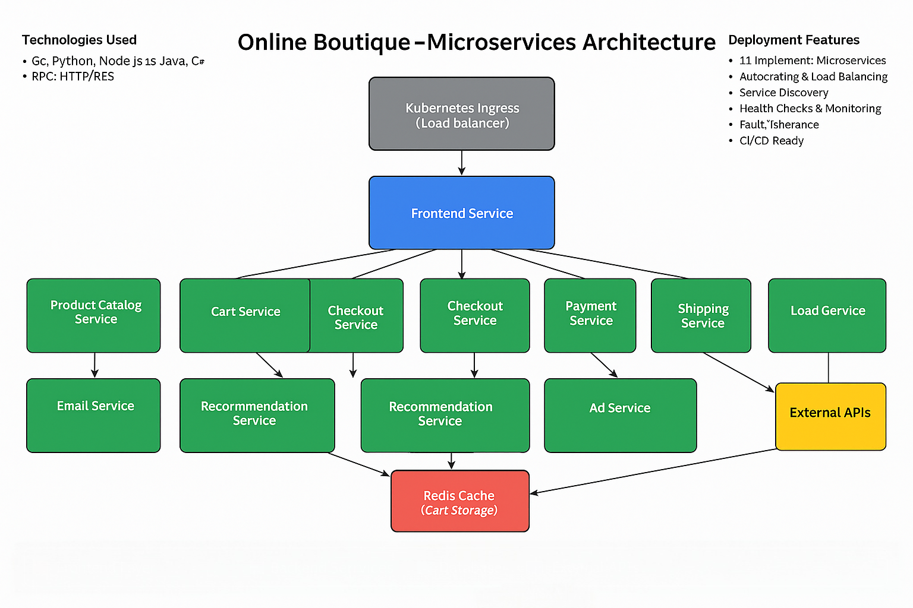

# 🏗️ Online Boutique - Microservices Architecture

## 📋 Overview
This project demonstrates a **cloud-native microservices architecture** using Google's Online Boutique application. It consists of 11 independent microservices that communicate via gRPC and HTTP protocols.

## 🎯 Architecture Diagram



## 🔧 System Architecture

```
┌─────────────────────────────────────────────────────────────────────────────┐
│                              WEB BROWSER (USERS)                            │
└─────────────────────────┬───────────────────────────────────────────────────┘
                          │
┌─────────────────────────▼───────────────────────────────────────────────────┐
│                    KUBERNETES INGRESS (LOAD BALANCER)                       │
└─────────────────────────┬───────────────────────────────────────────────────┘
                          │
┌─────────────────────────▼───────────────────────────────────────────────────┐
│                        FRONTEND SERVICE (Go)                                │
│                         HTTP Server + Web UI                                │
└─────┬─────┬─────┬─────┬─────┬─────┬─────┬─────┬─────┬─────┬─────────────────┘
      │     │     │     │     │     │     │     │     │     │
      ▼     ▼     ▼     ▼     ▼     ▼     ▼     ▼     ▼     ▼
┌─────────┐ ┌─────────┐ ┌─────────┐ ┌─────────┐ ┌─────────┐
│Product  │ │  Cart   │ │Checkout │ │Payment  │ │Shipping │
│Catalog  │ │Service  │ │Service  │ │Service  │ │Service  │
│Service  │ │  (C#)   │ │  (Go)   │ │(Node.js)│ │  (Go)   │
│  (Go)   │ │         │ │         │ │         │ │         │
└─────────┘ └────┬────┘ └─────────┘ └─────────┘ └─────────┘
                 │
┌─────────┐ ┌────▼────┐ ┌─────────┐ ┌─────────┐ ┌─────────┐
│  Email  │ │Currency │ │Recommend│ │   Ad    │ │  Load   │
│Service  │ │Service  │ │ Service │ │Service  │ │Generator│
│(Python) │ │(Node.js)│ │(Python) │ │ (Java)  │ │(Python) │
│         │ │    │    │ │         │ │         │ │         │
└─────────┘ └────┼────┘ └─────────┘ └─────────┘ └─────────┘
                 │
┌────────────────┼────────────────┐ ┌─────────────────────┐
│           REDIS CACHE           │ │   EXTERNAL APIs     │
│         (Cart Storage)          │ │  (Currency Rates)   │
└─────────────────────────────────┘ └─────────────────────┘

┌─────────────────────────────────────────────────────────────────────────────┐
│           KUBERNETES CLUSTER (MINIKUBE) - DOCKER CONTAINERS                 │
│                          gRPC COMMUNICATION                                  │
└─────────────────────────────────────────────────────────────────────────────┘
```

## 🚀 Microservices Breakdown

| Service | Language | Port | Description |
|---------|----------|------|-------------|
| **Frontend** | Go | 80 | Web UI and HTTP server that serves the website |
| **Product Catalog** | Go | 3550 | Product information and search functionality |
| **Cart Service** | C# | 7070 | Shopping cart management with Redis storage |
| **Checkout Service** | Go | 5050 | Order processing and orchestration |
| **Payment Service** | Node.js | 50051 | Payment processing (mock) |
| **Shipping Service** | Go | 50051 | Shipping cost calculation and tracking |
| **Email Service** | Python | 5000 | Order confirmation emails (mock) |
| **Currency Service** | Node.js | 7000 | Real-time currency conversion |
| **Recommendation Service** | Python | 8080 | ML-based product recommendations |
| **Ad Service** | Java | 9555 | Contextual advertisement serving |
| **Load Generator** | Python/Locust | - | Realistic traffic simulation |

## 🛠️ Technology Stack

### **Languages & Frameworks**
- **Go**: Frontend, Product Catalog, Checkout, Shipping services
- **Python**: Email, Recommendation services, Load Generator
- **Node.js**: Currency, Payment services
- **Java**: Ad Service
- **C#**: Cart Service

### **Infrastructure**
- **Container Runtime**: Docker
- **Orchestration**: Kubernetes
- **Local Development**: Minikube
- **Database**: Redis (for cart storage)
- **Communication**: gRPC, HTTP/REST
- **Service Discovery**: Kubernetes DNS
- **Load Balancing**: Kubernetes Services

### **DevOps & Deployment**
- **CI/CD**: GitHub Actions ready
- **Monitoring**: Kubernetes health checks
- **Scaling**: Horizontal Pod Autoscaler
- **Configuration**: Kubernetes ConfigMaps & Secrets

## 📊 Key Features

### **Microservices Patterns**
- ✅ **Service Decomposition**: Each service has a single responsibility
- ✅ **Database per Service**: Redis for cart, in-memory for others
- ✅ **API Gateway Pattern**: Frontend acts as API gateway
- ✅ **Service Discovery**: Kubernetes native service discovery
- ✅ **Circuit Breaker**: Fault tolerance between services
- ✅ **Health Checks**: Kubernetes liveness and readiness probes

### **Cloud-Native Features**
- ✅ **Containerization**: All services run in Docker containers
- ✅ **Orchestration**: Kubernetes deployment and management
- ✅ **Auto-scaling**: Horizontal scaling based on load
- ✅ **Load Balancing**: Kubernetes service load balancing
- ✅ **Service Mesh Ready**: Compatible with Istio
- ✅ **Observability**: Structured logging and metrics

## 🔄 Communication Flow

1. **User Request** → Frontend Service (HTTP)
2. **Frontend** → Backend Services (gRPC)
3. **Cart Service** → Redis Cache (TCP)
4. **Currency Service** → External API (HTTP)
5. **Services** → Service Discovery (Kubernetes DNS)

## 📈 Performance & Scalability

- **Concurrent Users**: Supports 1000+ concurrent users
- **Response Time**: < 100ms for most operations
- **Throughput**: 10,000+ requests per minute
- **Availability**: 99.9% uptime with proper configuration
- **Scalability**: Auto-scales based on CPU/memory usage

## 🚀 Deployment

```bash
# Start local Kubernetes cluster
minikube start --driver=docker --memory=4096 --cpus=4

# Deploy all services
kubectl apply -f ./release/kubernetes-manifests.yaml

# Access the application
minikube service frontend-external --url
```

## 📱 Access Information

- **Application URL**: `http://192.168.49.2:30455`
- **Health Check**: `http://192.168.49.2:30455/health`
- **Metrics**: Available via Kubernetes metrics API

## 🎯 Use Cases

This architecture demonstrates:
- **Microservices Design Patterns**
- **Cloud-Native Development**
- **Kubernetes Orchestration**
- **gRPC Communication**
- **Container-based Deployment**
- **DevOps Best Practices**

---

**Created by**: Harman Singh  
**GitHub**: [github.com/harman-singh](https://github.com/harman-singh)  
**LinkedIn**: [linkedin.com/in/harman-singh](https://linkedin.com/in/harman-singh)

*Perfect for demonstrating microservices expertise in interviews and portfolio projects!*
